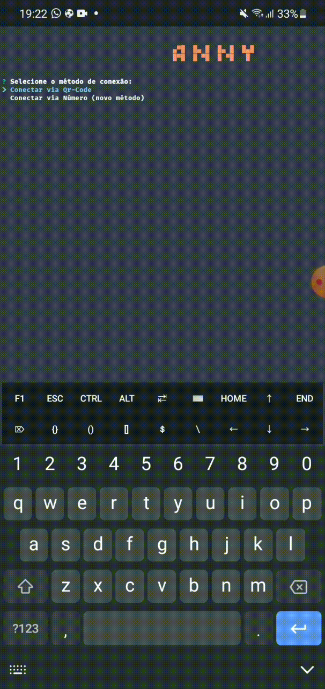

</img>
<h1 align="center">Anny Bot</h1>

<p>Anny Bot foi pensado para ser um projeto open-source, isso significa que qualquer pessoa pudesse ter acesso ao código. Aí está, espero que gostem desse Bot quem fiz com tanto carinho :).</p>

<p align="center">
  <a href="https://github.com/hell-ctrl">
    
  </a>
    <a href="https://wa.me/559887583208">
    
  </a>
</p>

<h2>Tecnologias Ultilizadas 🤔</h2>

<p align="center">
  <a href="https://www.javascript.com">
    
  </a>
  <a href="https://nodejs.org/">
    
  </a>
</p>

<h2>Agora você pode conectar o bot no WhatsApp por número ou por qrcode. 😃</h2>
<p>Escolha entre número ou qrcode.</p>
<div align="center"></img></div>


<h2>Comandos da Anny ✅</h2>

<p><strong>Aviso:</strong> Para usar os comandos, você precisa usar algúm dos prefixos antes dos comandos ("/", ".", "!").</p>

<p><strong>Exemplo:</strong> /menu</p>

<table>
  <thead>
    <tr>
      <th>Comando</th>
      <th>Descrição</th>
    </tr>
  </thead>
  <tbody>
    <tr>
      <td>Menu</td>
      <td>Abre o menu que lista todos os comandos.</td>
    </tr>
    <tr>
      <td>Criador</td>
      <td>Contato do criador do bot.</td>
    </tr>
    <tr>
      <td>Sugestao</td>
      <td>Envie uma sugestão para o criador do bot.</td>
    </tr>
    <tr>
      <td>Infobot</td>
      <td>Informações sobre o bot.</td>
    </tr>
    <tr>
      <td>Perfil</td>
      <td>Informações sobre seu perfil.</td>
    </tr>
    <tr>
      <td>Fig</td>
      <td>Crie uma figurinha a partir de uma img ou vídeo..</td>
    </tr>
    <tr>
      <td>Toimg</td>
      <td>Converte uma figurinha para imagem.</td>
    </tr>
    <tr>
      <td>Togif</td>
      <td>Converte uma figurinha para gif.</td>
    </tr>
    <tr>
      <td>Play_audio</td>
      <td>om Download áudio do YouTube.</td>
    </tr>
    <tr>
      <td>Play_video</td>
      <td>Download vídeo do YouTube.</td>
    </tr>
    <tr>
      <td>Ig_dl</td>
      <td>Download vídeo, story ou imagem do Instagram.</td>
    </tr>
    <tr>
      <td>Tkk_dl</td>
      <td>Download video do TikTok.</td>
    </tr>
    <tr>
      <td>Editar_arquivo</td>
      <td>Edite qualquer arquivo do bot (apenas o dono pode usar).</td>
    </tr>
  </tbody>
</table>


<h2>Instalação ⚙️</h2>

<p>Antes de comecar a instalação, certifique-se de ter os seguintes pré-requisitos:</p>

<ul>
  <li>Git</li>
  <li>Nodejs</li>
  <li>Npm</li>
  <li>FFmpeg</li>
</ul>

<p>Siga os comandos de instalação abaixo:</p>

``` bash
> git clone https://github.com/hell-ctrl/anny-bot/
> cd anny-bot
> npm i
> chmod 777 start.sh
> npm start
```

<p>Para mudar o número do dono, do bot, e o nome dele, abra o aquivo <a href="src/configs/info.json">info.json</a></p>

``` json
{
  "botNumber": "5598875512460", // seu número do bot
  "botName": "Anny Bot", // nome do seu bot
  "botOwner": "559887583208" // número do dono do bot
}
```
<p><strong>Aviso:</strong> Se os comandos não funcionarem de primeira, espere um pouco e depois reinicie o bot.</p>

<h2>Testado em 💻</h2>

<ul>
  <li>Termux</li>
  <li>Linux</li>
  <li>Windows/wsl</li>
</ul>

<h2>License ☕</h2>

This project is licensed by [Apache License 2.0](https://www.apache.org/licenses/LICENSE-2.0) - see the [LICENSE](LICENSE) file for more details.


